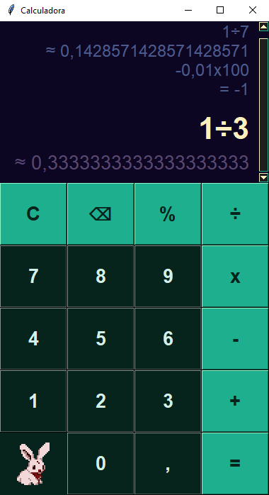
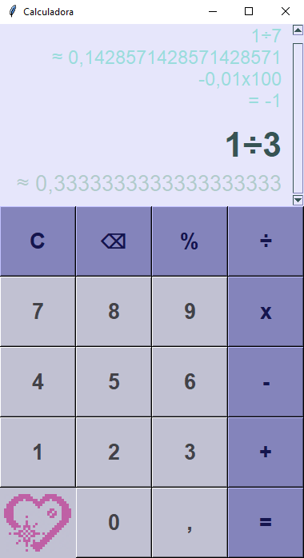

# 🧮 Calculadora personalizada em Python com interface Tkinter

Referência base: vídeo "Como fazer Calculadora em Python | Python na prática" (Simplificado por João, 2021).

Feita em: 22/07-05/08/2025

---

## ✅ Características

- Versão do Python usada: 3.12.10
- Código estruturado em MVC
- Suporte a expressões com operações básicas (+, -, *, /, %)
- Precisão com Decimal (evita erros do tipo float)
- Interface gráfica com Tkinter
- Painel rolável com histórico, expressão e resultado parcial
- Suporte a scroll do mouse e teclado
- Mensagem e tema alternativo para minha namorada

---

## 📷 Capturas de tela

*Demonstrações do tema padrão e do tema alternativo, com histórico e resultado parcial ativados*

---

## 🛠️ Otimização remanescente identificada

- Corrigir bug visual de flutuação dos itens no painel